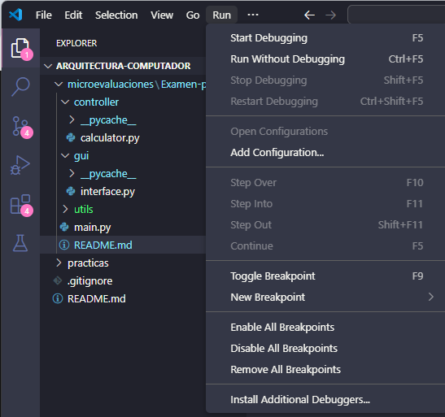
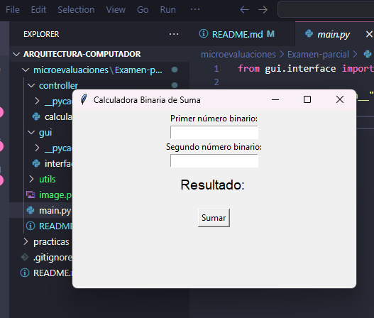

# Calculadora Binaria de Suma 🧮

Una sencilla calculadora que permite sumar dos números binarios usando una interfaz gráfica construida con Tkinter en Python.

---

## 🚀 Características

- Validación de entrada para asegurar que solo se ingresen números binarios.
- Interfaz amigable y fácil de usar.
- Código modular organizado en carpetas: `controller`, `gui`, `utils`.
# Como aser correr el programa
-python3 --version
-python3 main.py
# Como aser correr el programa segunda opcion 
damos clic en main.py luego

Presionamos start Debugging

con eso completariamos 